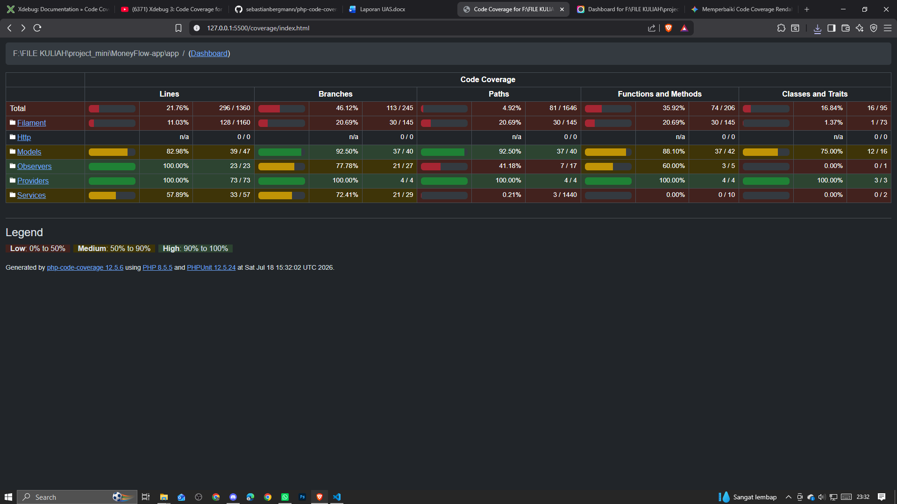
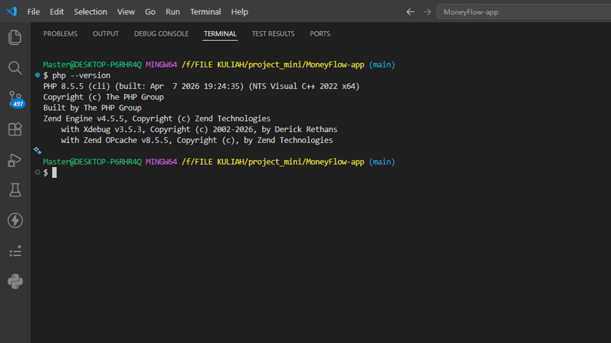

# HASIL CODE COVERAGE

## Berikut hasil dari code coverage yang telah dilakukankan : 

## Alat Kakas Bantu :
### Alat yang digunakan untuk melakukan proses code coverage adalah xdebug v3.5.3. 

## Version Detail Xdebug : 

